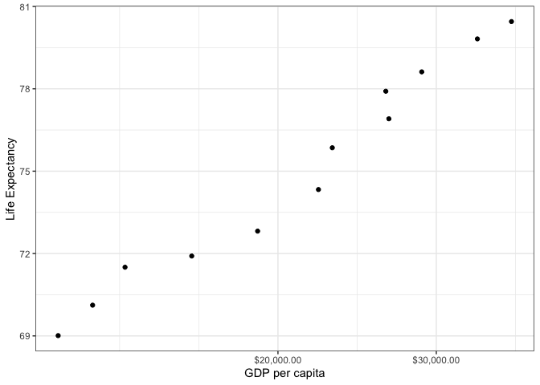
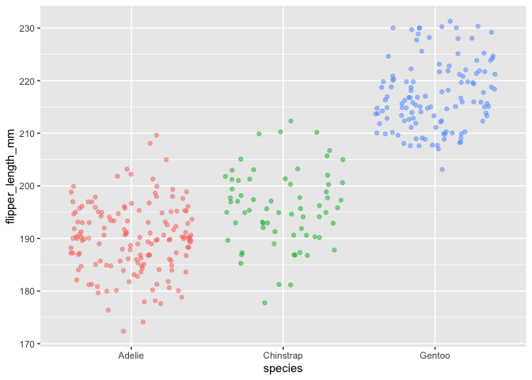

HW\_02
================
Sejal Keshvara
2/5/2020

# Exercise 1 Basic dplyr

``` r
library("gapminder")
library("dplyr")
```

    ## 
    ## Attaching package: 'dplyr'

    ## The following objects are masked from 'package:stats':
    ## 
    ##     filter, lag

    ## The following objects are masked from 'package:base':
    ## 
    ##     intersect, setdiff, setequal, union

# Exercise 1.1 Filter

``` r
gapminder %>% filter(year %in% (1970:1979), country %in% c("Canada", "Brazil", "Germany"))
```

    ## # A tibble: 6 x 6
    ##   country continent  year lifeExp       pop gdpPercap
    ##   <fct>   <fct>     <int>   <dbl>     <int>     <dbl>
    ## 1 Brazil  Americas   1972    59.5 100840058     4986.
    ## 2 Brazil  Americas   1977    61.5 114313951     6660.
    ## 3 Canada  Americas   1972    72.9  22284500    18971.
    ## 4 Canada  Americas   1977    74.2  23796400    22091.
    ## 5 Germany Europe     1972    71    78717088    18016.
    ## 6 Germany Europe     1977    72.5  78160773    20513.

# Exercise 1.2

``` r
gapminder  %>% 
  filter(year %in% (1970:1979), country %in% c("Canada", "Brazil", "Germany"))  %>% 
  select(country, gdpPercap)
```

    ## # A tibble: 6 x 2
    ##   country gdpPercap
    ##   <fct>       <dbl>
    ## 1 Brazil      4986.
    ## 2 Brazil      6660.
    ## 3 Canada     18971.
    ## 4 Canada     22091.
    ## 5 Germany    18016.
    ## 6 Germany    20513.

# Exercise 1.3

``` r
gapminder  %>% 
  filter(year %in% (1970:1979), country %in% c("Canada", "Brazil", "Germany"))  %>% 
  select(country, gdpPercap) %>% 
  lag(lifedrop = diff(lifeExpectancy))
```

    ## # A tibble: 6 x 2
    ##   country gdpPercap
    ##   <fct>       <dbl>
    ## 1 <NA>          NA 
    ## 2 Brazil      4986.
    ## 3 Brazil      6660.
    ## 4 Canada     18971.
    ## 5 Canada     22091.
    ## 6 Germany    18016.

# Exercise 1.4

``` r
gapminder  %>% 
  group_by(country)  %>% 
  filter(gdpPercap == max(gdpPercap))
```

    ## # A tibble: 142 x 6
    ## # Groups:   country [142]
    ##    country     continent  year lifeExp       pop gdpPercap
    ##    <fct>       <fct>     <int>   <dbl>     <int>     <dbl>
    ##  1 Afghanistan Asia       1982    39.9  12881816      978.
    ##  2 Albania     Europe     2007    76.4   3600523     5937.
    ##  3 Algeria     Africa     2007    72.3  33333216     6223.
    ##  4 Angola      Africa     1967    36.0   5247469     5523.
    ##  5 Argentina   Americas   2007    75.3  40301927    12779.
    ##  6 Australia   Oceania    2007    81.2  20434176    34435.
    ##  7 Austria     Europe     2007    79.8   8199783    36126.
    ##  8 Bahrain     Asia       2007    75.6    708573    29796.
    ##  9 Bangladesh  Asia       2007    64.1 150448339     1391.
    ## 10 Belgium     Europe     2007    79.4  10392226    33693.
    ## # … with 132 more rows

# Exercise 1.5 Scatterplot

``` r
library(gapminder)
library(ggplot2)
gapminder %>% 
  filter(country=="Canada")  %>% 
ggplot(gapminder, df, mapping = aes(gdpPercap, lifeExp)) +
  geom_jitter(alpha = 2) +
  scale_x_log10("GDP per capita", labels = scales::dollar_format()) +
  theme_bw() +
  ylab("Life Expectancy")
```

<!-- -->

# Exercise 2.1

``` r
library(palmerpenguins)
palmerpenguins::penguins  %>% 
group_by( body_mass_g)  %>% 
summarize(mu = mean(body_mass_g), sigma = sd(body_mass_g))
```

    ## # A tibble: 95 x 3
    ##    body_mass_g    mu sigma
    ##  *       <int> <dbl> <dbl>
    ##  1        2700  2700    NA
    ##  2        2850  2850     0
    ##  3        2900  2900     0
    ##  4        2925  2925    NA
    ##  5        2975  2975    NA
    ##  6        3000  3000     0
    ##  7        3050  3050     0
    ##  8        3075  3075    NA
    ##  9        3100  3100    NA
    ## 10        3150  3150     0
    ## # … with 85 more rows

# Exercise 2.2

``` r
library(palmerpenguins)
library(ggplot2)
palmerpenguins::penguins %>%
 ggplot(data = penguins, df, mapping = aes(x = species, y = flipper_length_mm)) +
  geom_jitter(aes(color = species), alpha = 0.5, show.legend = FALSE)
```

    ## Warning: Removed 2 rows containing missing values (geom_point).

<!-- -->

``` r
  labs(x = "Species",
       y = "Flipper length (mm)")
```

    ## $x
    ## [1] "Species"
    ## 
    ## $y
    ## [1] "Flipper length (mm)"
    ## 
    ## attr(,"class")
    ## [1] "labels"
