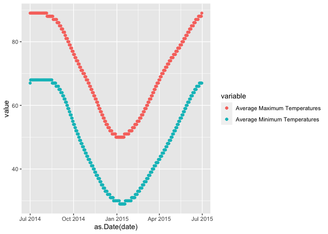
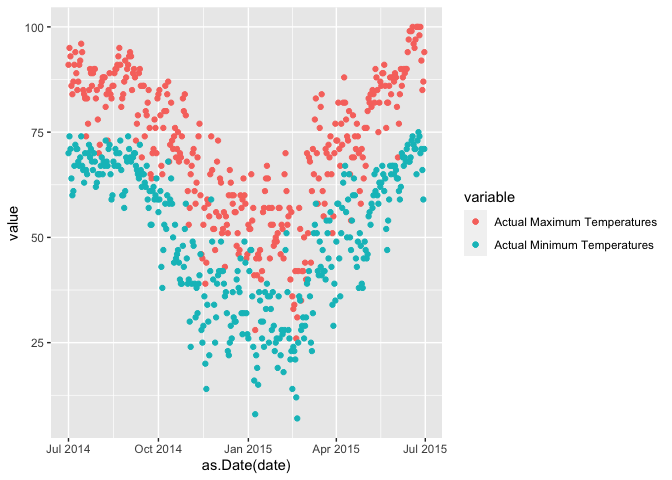
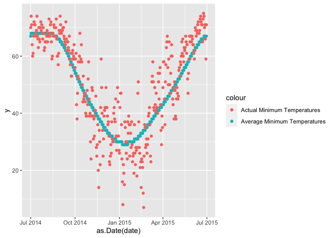
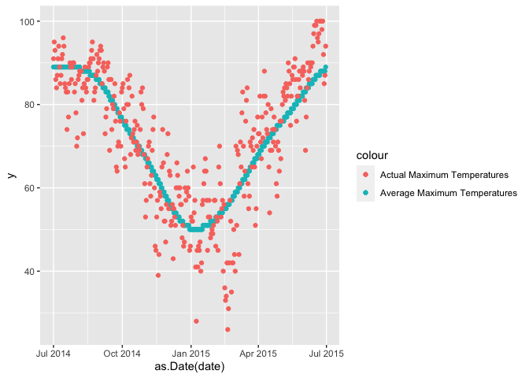
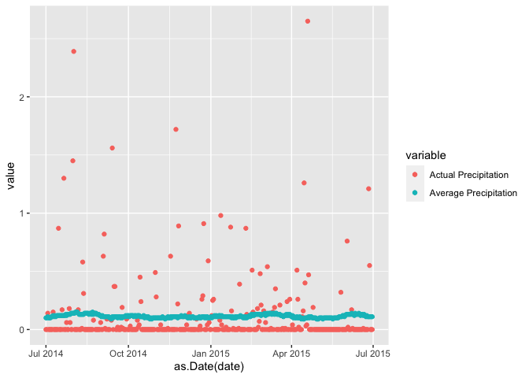

final\_project
================
Sejal Keshvara
05-02-2021

``` r
library(tidyverse)
```

    ## ── Attaching packages ─────────────────────────────────────── tidyverse 1.3.0 ──

    ## ✓ ggplot2 3.3.3     ✓ purrr   0.3.4
    ## ✓ tibble  3.0.6     ✓ dplyr   1.0.4
    ## ✓ tidyr   1.1.2     ✓ stringr 1.4.0
    ## ✓ readr   1.4.0     ✓ forcats 0.5.1

    ## ── Conflicts ────────────────────────────────────────── tidyverse_conflicts() ──
    ## x dplyr::filter() masks stats::filter()
    ## x dplyr::lag()    masks stats::lag()

``` r
library(readr)
library(dplyr)
library(ggplot2)
library(scales)
```

    ## 
    ## Attaching package: 'scales'

    ## The following object is masked from 'package:purrr':
    ## 
    ##     discard

    ## The following object is masked from 'package:readr':
    ## 
    ##     col_factor

``` r
library(lubridate)
```

    ## 
    ## Attaching package: 'lubridate'

    ## The following objects are masked from 'package:base':
    ## 
    ##     date, intersect, setdiff, union

``` r
url <- "https://raw.githubusercontent.com/fivethirtyeight/data/master/us-weather-history/KCLT.csv"

weather_data <- read_csv(url)
```

    ## 
    ## ── Column specification ────────────────────────────────────────────────────────
    ## cols(
    ##   date = col_character(),
    ##   actual_mean_temp = col_double(),
    ##   actual_min_temp = col_double(),
    ##   actual_max_temp = col_double(),
    ##   average_min_temp = col_double(),
    ##   average_max_temp = col_double(),
    ##   record_min_temp = col_double(),
    ##   record_max_temp = col_double(),
    ##   record_min_temp_year = col_double(),
    ##   record_max_temp_year = col_double(),
    ##   actual_precipitation = col_double(),
    ##   average_precipitation = col_double(),
    ##   record_precipitation = col_double()
    ## )

``` r
print(weather_data)
```

    ## # A tibble: 365 x 13
    ##    date  actual_mean_temp actual_min_temp actual_max_temp average_min_temp
    ##    <chr>            <dbl>           <dbl>           <dbl>            <dbl>
    ##  1 2014…               81              70              91               67
    ##  2 2014…               85              74              95               68
    ##  3 2014…               82              71              93               68
    ##  4 2014…               75              64              86               68
    ##  5 2014…               72              60              84               68
    ##  6 2014…               74              61              87               68
    ##  7 2014…               79              67              91               68
    ##  8 2014…               83              72              94               68
    ##  9 2014…               80              71              89               68
    ## 10 2014…               78              71              85               68
    ## # … with 355 more rows, and 8 more variables: average_max_temp <dbl>,
    ## #   record_min_temp <dbl>, record_max_temp <dbl>, record_min_temp_year <dbl>,
    ## #   record_max_temp_year <dbl>, actual_precipitation <dbl>,
    ## #   average_precipitation <dbl>, record_precipitation <dbl>

\#This dataframe includes the average as well as actual temperatures and
precipitation levels in the United States from 2014 to 2015. Since the
dataframe is already cleaned out (there are no missing values or 0’s), I
moved on to plotting the data to help me answer some questions I had
about the differences in temperature as well as precipitation levels.

\#This plot is to show how the average maximum temperatures compare to
the average minimum temperatures.

``` r
df <- select(weather_data, date, average_min_temp, average_max_temp)
ggplot(df, aes(as.Date(date), y = value, color = variable)) + 
    geom_point(aes(y = average_max_temp, col = "Average Maximum Temperatures")) + 
    geom_point(aes(y = average_min_temp, col = "Average Minimum Temperatures"))
```

<!-- -->

\#Here we compare the actual minimum and the actual maximum temperatures
in the united states from the years 2014 to 2015.

``` r
df <- select(weather_data, date, actual_max_temp, actual_min_temp)
  ggplot(df, aes(as.Date(date), y = value, color = variable)) +
    geom_point(aes(y = actual_max_temp, col = "Actual Maximum Temperatures")) +
    geom_point(aes(y = actual_min_temp, col = "Actual Minimum Temperatures"))
```

<!-- -->

# The scatter plot shows that the actual maximum and minimum temperatures are fairly separated except during the winter months where the highest temperatures are as cold as how some of the minimum temperatures get.

\#The actual and average minmimum temperatures are compared on the
scatter plot. I was interested in finding out how the temperatures from
2014-2105 compare to the average temperatures.

``` r
df <- select(weather_data, date, average_min_temp, actual_min_temp)
  ggplot(df, aes(as.Date(date), y = "Temperature", color = "blue")) +
    geom_point(aes(y = average_min_temp, col = "Average Minimum Temperatures")) +
    geom_point(aes(y = actual_min_temp, col = "Actual Minimum Temperatures"))
```

<!-- --> \#
What I found from the scatter plot was that the temperatures have stayed
fairly consistent with the average temperatures although it seems that
during the summer months, the actual minimum temperatures stoop far
below the the average during the winter months especially around the
Feburary-March time period of 2015.

``` r
df <- select(weather_data, date, average_max_temp, actual_max_temp)
  ggplot(df, aes(as.Date(date), y = "Temperature", color = "green")) +
    geom_point(aes(y = average_max_temp, col = "Average Maximum Temperatures")) +
    geom_point(aes(y = actual_max_temp, col = "Actual Maximum Temperatures"))
```

<!-- --> \#
With the actual maximum temperatures, it is a similar case as the
minimum temperatures. However, there seems to be more lower actual
temperatures compared to the average during the early spring months.

\#Now I wanted to compare the actual and average precipitation within
the years of 2014-2015.

``` r
df <- select(weather_data, date, actual_precipitation, average_precipitation)
  ggplot(df, aes(as.Date(date), y =value, color = variable)) +
    geom_point(aes(y = actual_precipitation, col = "Actual Precipitation")) +
    geom_point(aes(y = average_precipitation, col = "Average Precipitation"))
```

<!-- -->

\#The values of record precipitation are grouped together based on the
year they occured in.

``` r
df3 <- select(weather_data, date, record_precipitation)
  df3 %>% 
  mutate(date = as.Date(date)) %>% 
  mutate(y = format(date, '%Y')) %>% 
  group_by(y)
```

    ## # A tibble: 365 x 3
    ## # Groups:   y [2]
    ##    date       record_precipitation y    
    ##    <date>                    <dbl> <chr>
    ##  1 2014-07-01                 5.91 2014 
    ##  2 2014-07-02                 1.53 2014 
    ##  3 2014-07-03                 2.5  2014 
    ##  4 2014-07-04                 2.63 2014 
    ##  5 2014-07-05                 1.65 2014 
    ##  6 2014-07-06                 1.95 2014 
    ##  7 2014-07-07                 2.37 2014 
    ##  8 2014-07-08                 1.87 2014 
    ##  9 2014-07-09                 3.71 2014 
    ## 10 2014-07-10                 2.45 2014 
    ## # … with 355 more rows

\#What I would like to do in the future is to focus on a wider date
range spanning decades to truly see the long term changes of average
temperature in the United states.
